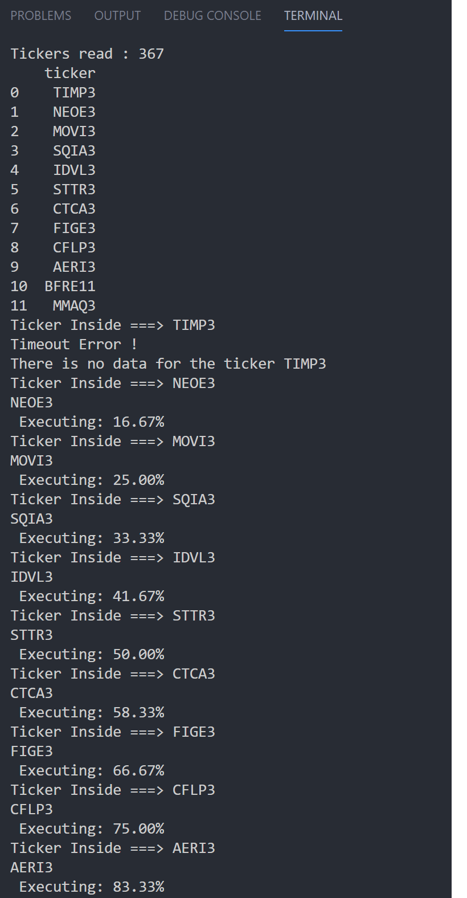

# Stock Analysis

## What does this program do ?

It reads financial information from a Brazilian web site, for all the stocks in the Brazilian market. I created as a personal project to help me choose the best deals in the stock market.
There are 3 main functions:
- get_tickers(): It reads all available tickers in the Finacial web site and save it symbols in a csv file (tickers.csv)
- get_metrics(): I readt all financial metrics for further analysis and save all those metrics in a cvs file (metrics.csv)
- main(): Coordenate the main logic in order to get the csv files

There is another file (dy_roe.csv) witch contains historical values, from previous years, for Dividend Yield and Return over investiment.\
I use the libriries BeautifulSoup for the web scrapping and pandas to work with data frames.

## How to execute this program ?
There are two options:
1) Delete the tickers.csv and the metrics.csv files and then run the program (python stockanalysis.py)
    This will recreate all files and generate the metrics.csv with all the financial information related to the tickers
2) Delete onde the metrics.csv and run the program
    This will generate an update metrics.csv without reading all tickers symbols again

## What can go wrong ?
1) Sometimes the web site with the financial information block the access if there was several requests in a specific period of time. I
n order to avoid that I create some save points to save a temporary metrics.csv file, if anything happended I can re-run the programa and it 
will continue, more or less, from where it was stopped.

2) The Finacial web site changed its strutured os tags.
In that case the web scrapping program must be change to accomodate the new structure. That's the downside of use web scrapping.

## What can go wrong ?
After I collected all those information, I use Excel to apply a formula, that I created, to score the best stocks based on, DY, ROE, Debts, etc.

- Have Fun !!!

### Pics from Execution and final result

<!---->

