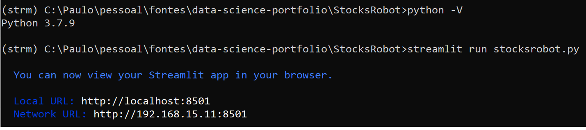

# Stock's Robot

## What does this program do ?

- It reads stocks prices from yahoo finance, calculates the returns and standart deviation for each stock in the informed period.
- Show the data in a graphical interface using streamlit lib
- Besides that it allows a simulation for a stock return using moving averages. 
- From a start date the program uses several parameters to calculate which strategies whould be better (buy/hold or day trade) in order to maximize the return.
- The paremeters are 
    Initial Investiment: The staring value investment
    Increasing days: After how many days of positive valuation before buy
    Decreasing days: After how many days of negative valuation before buy
    Circuit Breaker(%): After loose X% sold the stock
    CB (Circuit Breaker) waitting days: After a Circuit Breaken, how many days of waitting before start buy again
 

## How to execute this program ?
- The Programa works based on .csv files and yahoo finance
- You can use the pre-selected stocks include in the B3_new.csv, or you can edit this file to include or exclude stock as you wish.
- After that just call the program: 
   streamlit run strocksrobot.py

- The execution will open a web browser application in the localhost:8501
- It is possible to assign another port (i.e. 8080) by using: streamlit run strocksrobot.py --server.port 8080

## What can go wrong ?
Sometimes execution from VisualStudio Code presents issues, even selecting the correct environment, VS Code uses the "base" version of Anaconda with is incompatible with python versions greatter then 3.7.9.

### Pics from Execution

<!---->

- Have Fun !!!

