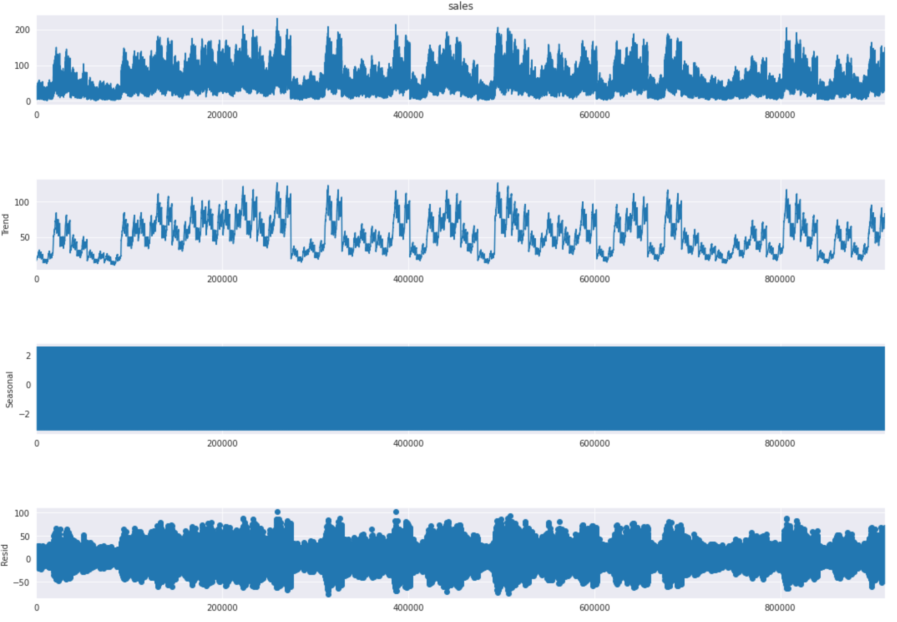
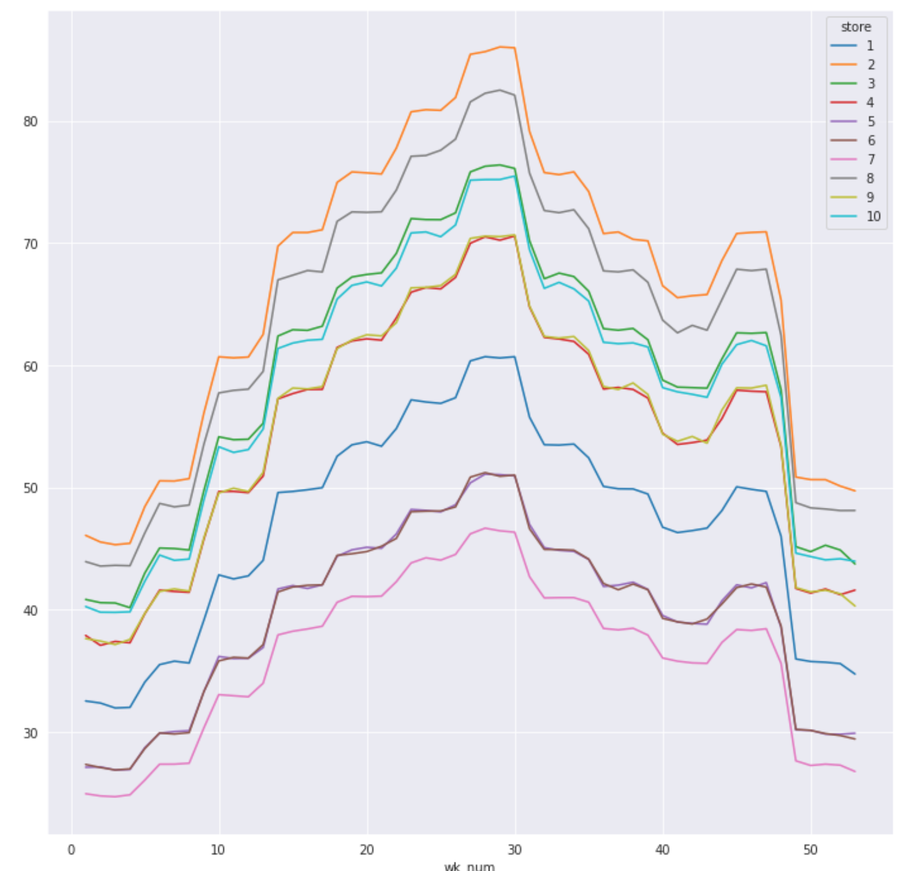
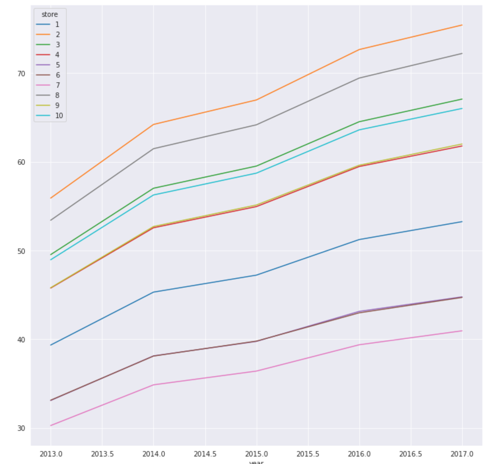
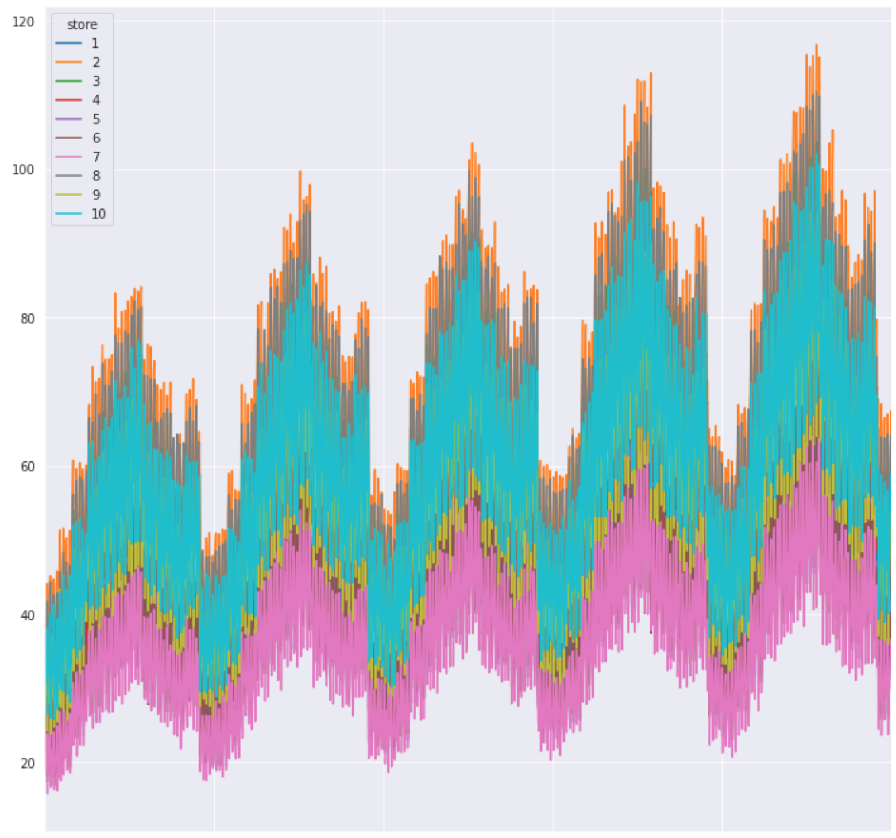
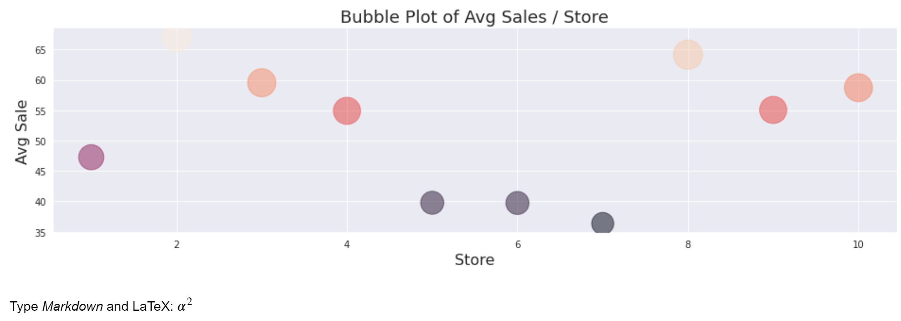
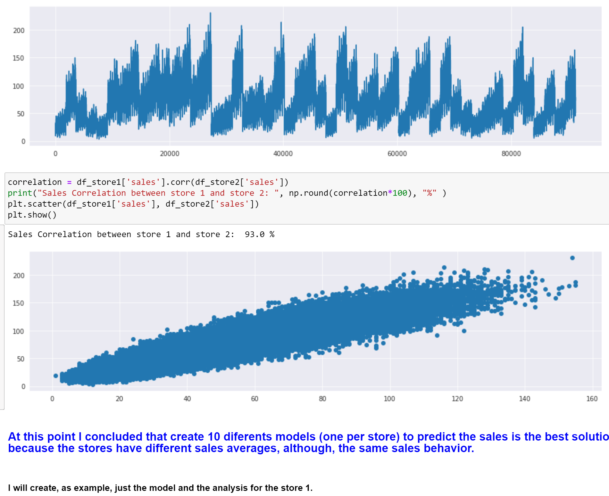
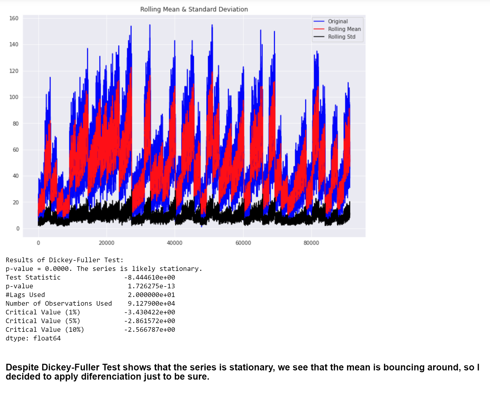
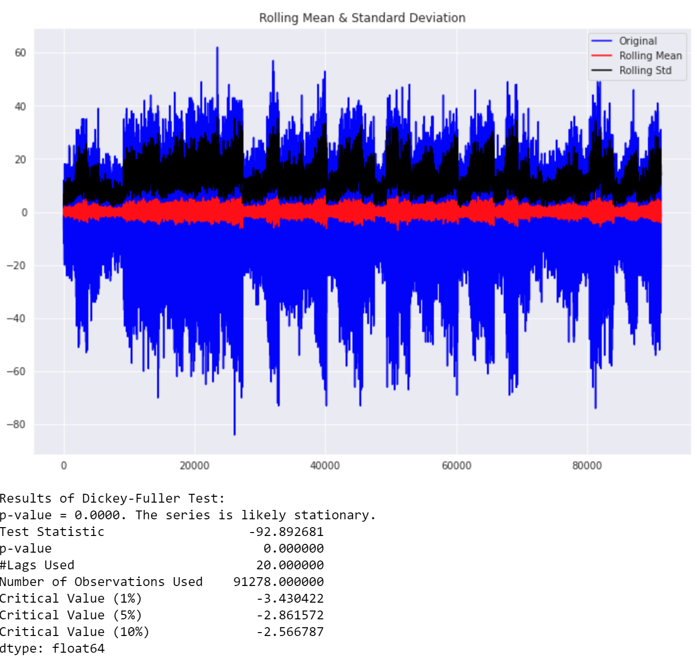
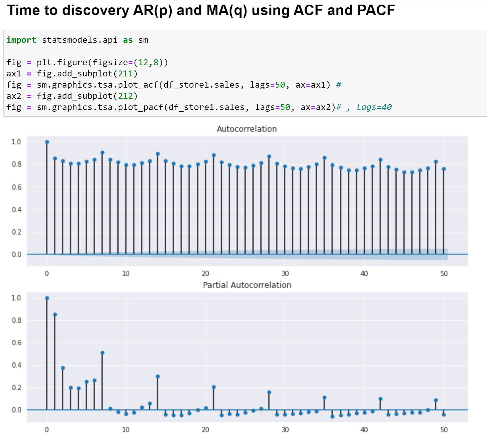

# Time Series Analysis

## What does this jupyter notebook is aimed for  ?

The goal with this notebook is to understand time series forecasting models such as ARIMA, its parameters (p,d,q), as well as its variation SARIMA.

AR(p): Auto-regression term => The lags of the previous value (from the pacf test)

I(d):  Integral term        => For non-stationary differencing

MA(q): Moving Average       => For the error term (from the acf test)

I am using the dataset ¨Store Item Demand Forecasting" from Kaggle Challenge.

Notebook Outline:

- ARIMA introduction
- Exploratory Data Analysis
- Decompose the ts
- Stationarize the data
- Interpret ACF and PACF
- Determine p, d, q
- Adding seasonality: S-ARMIA
- Make some predictions
 
The model did  not capture all the information from the data, It was a good exercise to understand Time Series, for a future study I'll use another dataset, a normal one, because this one that I used in this trainning is clearly fabricaded and I wanna deal with a more realistic dataset.

## How to execute this program ?
- Just calll jupyter notebook from the command line

### Pics from Analysis

<!---->

- Have Fun !!!

