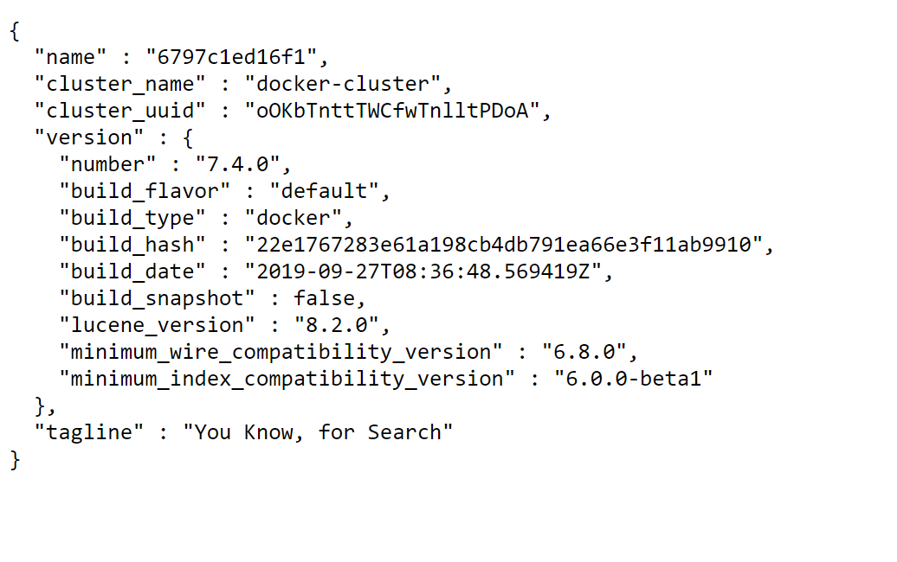

# Search, Autocomplete and Elasticsearch

## What does this program do ?

- It creates simple autocomplete application based on several solutions that I found over the internet combined in one unique project.
- The project uses the netflix movies database which was include in the Elasticsearch database using the jupyter notebook "ES-LoadData" in order to create an index to use in the search mechanism.

## How this application is structured  ?

It's a docker compose to glue all the components and to simplify it's execution.
The application has the following parts: 

1) Front-end (home.html/app.py): Compose of a HTML that call an api using javascript, and an api created using the Flask framework that calls the backend api. It receives the return from the back-end and send it back to the HTML to be rendered.

2) Back-end api (api.py):  It receives a call, from the front-end api, along with a string parameter, witch is the text to search for in the movies catalog. 
   Then it calls the elastic search api using a specific query to search the informed text in the movie catalog index.

3) Elasticsearch: The index database created using the netflix_titles.cvs

## How to execute this program ?
- There are several ways to do that, I'll explain how I do that in my environment:
1) Start the docker application in windows
2) In the VS Code, start all services by right clicking on the "docker-compose.yml" file and select "Compose Up" (you should have installed the Docker extension)
3) If that Index database is empty executes the jupyter notebook "ES-LoadData" in order to create the data base
4) Tests if Elasticsearch is up by accessing: http://localhost:9200/
5) Also tests if Kibana is up by accessing: http://localhost:5601/
6) Open the main page application by accessing: http://localhost:5000/
7) Type any part of any movie name and see the instant render in the page with the movies that fits the criteria

## What can go wrong ?
Besides the fact that all libraries should be installed, the only issue that I find somethimes is during the docker-compose initialization. 
It take some attempties somethimes in order to have everything up, just make sure the docker application is up, if there is any previus application create for the search-autocomplete, just delete it.
After that run again "Compose Up", if it doesn't work try "Compose Restart" using the mouse right click button from the "docker-compose.yml" file.

### Pics from Execution

<!---->

- Have Fun !!!

